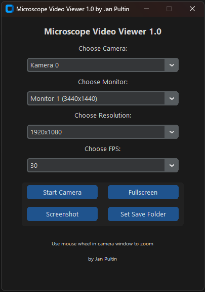

**Microscope Video Viewer 1.0**  
_A modern, minimalistic desktop application built with Python, OpenCV, and CustomTkinter to display live video streams from USB microscopes or webcams. Created by Jan Pultin._

---

## ✅ Features

- **📷 Camera Selection**: Index-based listing of all connected cameras.  
- **🔄 Refresh Cameras**: Quickly rescan attached devices with a responsive loading screen.  
- **🖥️ Monitor Selection**: Choose which monitor to display the video on.  
- **🎛️ Dynamic Settings Grid**: 2×2 layout for Resolution, FPS, Codec, and **Refresh Camera Max Settings** button.  
- **🖼️ Resolution Presets**: Auto-detected common resolutions (4K, 1440p, 1080p, 720p, etc.) per device.  
- **⏱️ Adjustable FPS**: Test and select supported frame rates (15, 30, 60).  
- **🎨 Codec Detection**: Live identification of compatible FOURCC codecs (`MJPG`, `YUY2`, `NV12`, `RGB3`) with loading indicator.  
- **Ⓜ️ Fullscreen Toggle**: Enter/exit fullscreen via button or F11.  
- **📸 Screenshot Capture**: Take and save current frame in user‑chosen folder.  
- **🖱️ Live Zoom**: Mouse wheel support within the video window.  
- **🌓 Dark Theme**: Modern dark‑blue color scheme by CustomTkinter.  

---

## 📸 Screenshot



## 🚀 Installation

1. **Prerequisites**:  
   - Python 3.10 or higher  
   - Git (optional, for cloning)

2. **Clone Repository**:  
   ```bash
   git clone https://github.com/janptn/microscope-viewer.git
   cd microscope-viewer
   ```

3. **Install Dependencies**:  
   ```bash
   pip install -r requirements.txt
   ```
   **Example** `requirements.txt`:  
   ```
   opencv-python
   customtkinter
   screeninfo
   numpy
   ```

---

## ▶️ Usage

Run the application:
```bash
python main.py
```

**Controls**:
- Select **Camera**, **Monitor**, **Resolution**, **FPS**, and **Codec** from dropdowns.  
- Click **Refresh Cameras** to rescan devices.  
- Use **Refresh Camera Max Settings** to detect supported resolution, FPS, and codec for the selected camera (with clear loading screen).  
- **Start Camera** to begin live preview.  
- **Fullscreen** button or **F11** to toggle fullscreen view.  
- **Screenshot** to capture current frame.  
- **Set Save Folder** to choose directory for screenshots.  
- Mouse wheel for **zoom** within the video output window.  

---

## 🧠 Future Improvements

- **Device Name Display**: Integrate with FFmpeg or DirectShow for real device names.  
- **Video Recording**: Add start/stop recording to file.  
- **Advanced Filters**: Real‑time image processing (edge detection, contrast).  
- **Preferences**: Save user settings across sessions.  

---

## 👤 Author

**Jan Pultin** – Built for laboratory imaging, educational demonstrations, and research.

---

## 📄 License

This project is licensed under the MIT License.
