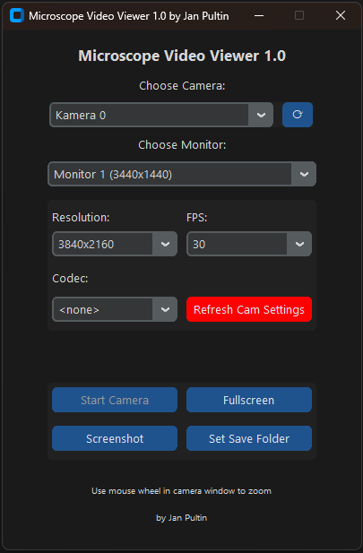

# 🔬 Microscope Video Viewer 1.0

A modern, minimalistic desktop application built with Python and OpenCV to display live video streams from USB microscopes or webcams.  
Created by **Jan Pultin** with a focus on full-screen monitoring, screenshot capture, and user-friendly controls.

---

## ✅ Features

- 📷 Select any connected camera (index-based listing)
- 🖥️ Choose which monitor to display the video on
- 🧩 Resolution presets: 4K, 1440p, 1080p, 720p (auto-detected per device)
- 🎞️ Adjustable frame rate: 15 / 30 / 60 FPS
- 🖼️ Fullscreen toggle via button or `F11`
- 📸 Take screenshots with one click
- 💾 Choose where screenshots are saved
- 🔍 Live zoom with mouse wheel in the camera window
- 🎨 CustomTkinter dark-themed modern UI

---

## 📸 Screenshot

> _(Insert screenshot of UI and fullscreen camera view here later)_

To embed images, use the following syntax (images must be in your repo folder):

```

```



---

## 🚀 Installation

### 1. Install Python (>= 3.10)
Download from [https://www.python.org](https://www.python.org)

### 2. Clone the repository
```bash
git clone https://github.com/yourname/microscope-viewer.git
cd microscope-viewer
```

### 3. Install dependencies
```bash
pip install -r requirements.txt
```

Example `requirements.txt`:
```
opencv-python
customtkinter
screeninfo
numpy
```

---

## ▶️ Usage

Run the application with:
```bash
python webcam.py
```

### Controls:
- Use dropdowns to select **camera**, **resolution**, **monitor**, and **FPS**
- Use mouse wheel inside the video window to zoom in/out
- Press `F11` or click **Fullscreen** to toggle fullscreen mode
- Click **Screenshot** to save the current frame
- Click **Set Save Folder** to choose where screenshots are saved

---

## ⚠️ Notes

- Camera detection is based on index (e.g. Camera 0, Camera 1). If you need real device names, integration with `ffmpeg` can be added.
- Screenshots are saved as `.png` with timestamp filenames.

---

## 🧠 To Do (Future Ideas)

- Real device name detection via ffmpeg or DirectShow
- Recording functionality
- Image enhancement or filters
- Settings memory between sessions

---

## 👤 Author

Developed by **Jan Pultin**  
For technical use with microscopes, camera tests, and educational experiments.

---

## 📄 License

This project is licensed under the MIT License.
